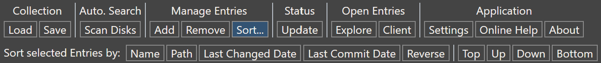
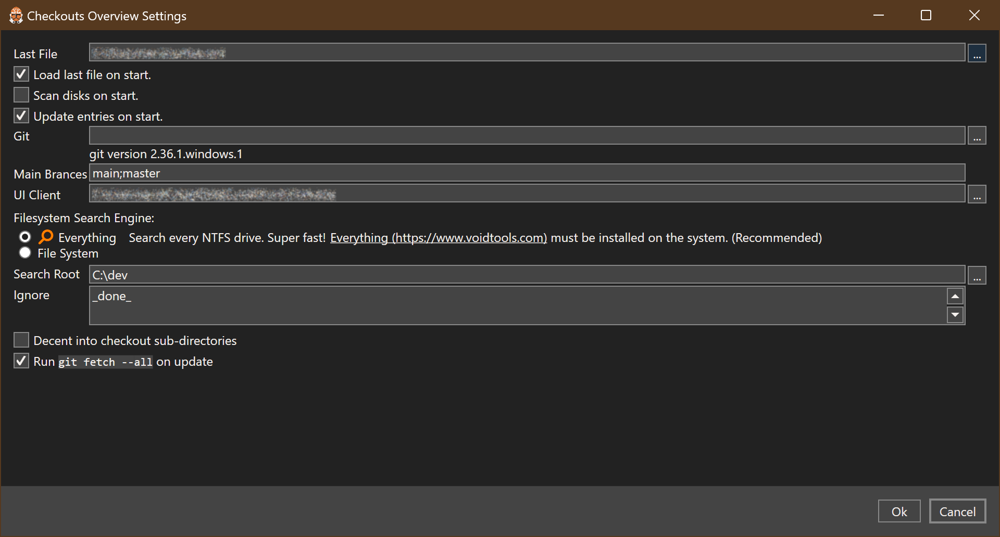

# Checkouts Overview - Usage Manual
Overview dashboard app for source code repository checkouts.

## Setup
The Checkouts Overview app is provided as portable zip.
No installation is required.
You can grab the [latest release](https://github.com/sgrottel/checkouts-overview/releases), or even pre-release from successful CI runs.

The zip file contains all files within a directory named `Checkouts-Overview`.
Extract it to any location on your computer you like.
Shortcuts, e.g. to the Desktop or the Start menu, are not generated automatically. If you want those, you need to create them yourself.
Since all future releases can be extracted in the same place, overwriting the previous files, your shortcuts will stay valid.

Your application settings are automatically migrated from older versions to newer versions (not the other way round).

## List of Entries

The main window is separated into the command bar at the top, the entry list in the center, and the edit details pane an the right.
The list of entries, also called the `Collection` is the main data for the application.

### Entries
Each entry represents one repository clone.
Each entry is defined by three fields:
* `Name` is a human readable display name for the entry.
This can be any arbitrary string.
* `Path` is the full file system path to the local repository clone.
You can use the `[...]` button next to the text boxes to browse of a path.
* `Type` is the type of the repository clone.
This is for future extensions.
Currently, the only supported value is `git` for git repository clones.
You can use the `[*]` button to auto-detect the repository type.

With the commands in the `Manage Entries` category, you can `[Add]` new entries to the collection and `[Remove]` the selected entries from the collection.
When you `[Add]` a new entry, all fields will be empty.
The new entry will be selected.

For all selected entries, edit boxes for the fields of the entries will be shown in the right edit details pane.
You can edit all entry values directly.
The values will be automatically updated, as soon as you leave any of the edit boxes.

The edit details pane also shows the `Status` for all selected entries.
This is a computed value.
This `Status` is a textual description, and the same information is also shown as the entry icon in the central entry list.

### Update
Trigger `Status | [Update]` to update this value for all entries or for all selected entries.
Possible status texts are:
* `Up to date` if the repository is on `main` branch and is in sync with the remote repository
* `⎇` to indicate that the repository is not on a `main` branch.
The actual branch name will be shown after the icon.
* `Failed to evaluate` if the status evaluation failed for any reason.
A reason is then usually displayed as text beneath the whole entry detail information.
* `Not available` if the entry's path could not be found.
* `local changes` if the entry has uncommitted local changes.
* `untracked` if the entry has no configured upstream remote.
* `ahead` if the entry has local commits which need to be pushed.
* `behind` if the remote repository has commits not available on the local repository.
This is only available, if those remote changes have been `fetched`.
The Checkouts Overview application will not automatically trigger the fetch operation.
You need to trigger this manually using your favorite git client.

### Icons
The status of each entry is visualized by it's icon as well.

The bottom halve of the icon represents the local checkout:
| Icon | Description |
| --- | --- |
|  | A circle shape indicates the local checkout is on the main branch. White color indicates that there are no local changes. |
|  | A polygon shape indicates the local checkout is on a branch. |
|  | An orange color indicates local changes, which have not been committed yet. |
|  | An orange color indicates local changes, which have not been committed yet. |

The top halve of the icon represents the status of the connected origin:
| Icon | Description |
| --- | --- |
|  | The current branch is not tracking any origin. |
|  | The current branch is ahead of it's origin and ready to push. |
|  | The current branch is behind it's origin, and you can pull in changes. |

Note: the indication of being behind the origin requires you to fetch the origin's state.
The "Checkouts Overview" application will not do this for you!

Combinations of all indicators are possible:
| Icon | Description |
| --- | --- |
|  | The local checkout is on the main branch. It does have local changes not committed yet. And, the local branch is ahead of the remote origin, ready to push. |

### Load/Save
The collection of entries can be automatically loaded, if configured accordingly in the application's settings.
Then the last file you are loading or saving, will be memorized of automatic load on application start.

When you trigger `[Save]` the current collection file's directory and file name will be pre-selected in the save dialog window.
The save dialog window will always be shown.
You can browse to any other local, change the name of the file, or simply press `Ok` to overwrite the existing file with the updated contents.

### Sort
Click on `[Sort...]` in the menu bar, and a second menu bar will open beneath, showing the sorting commands.

This first group of commands sorts all selected entries or all entries if non are selected.
* `Name` sorts alphabetically by the entries display names.
* `Path` sorts alphabetically by the full paths of the entries.
* `Last Changed Date` will sort by the date of the last change of any file within the subdirectories of the entries.
Be aware, that this needs to access the file system and might be slow to evaluate.
* `Last Commit Date` will sort the entries by the dates of the last commit into the respective repository.
Be aware, that this needs to access the file system and might be slow to evaluate.
* `Reverse` reverses the order of the entries.

All selected entries will be placed in the list where the first selected entry was.

The second group of commands will replace the selected entries.
* `Top` will move all selected entries to the beginning of the list.
* `Up` will move all selected entries one place before the first selected entry.
* `Down` will move all selected entries one place after the last selected entry.
* `Bottom` will move all selected entries to the end of the list.

The relative order within the selection will be kept.

The order of entries is part of the collection data.
If you want to persist the order, you need to save your collection.

## Scanning Disks
The application is capable of automatically scanning your file system to detect new repositories.

### Everything
Scan with [Everything](https://www.voidtools.com/) will scan all your NTFS disks with light speed fast performance.
You need to have Everything installed, and the Everything service needs to be running.

Just click `[Search with Everything]` and be amazed how quick it is.

### File System Scan
Scan with Filesystem manually iterates through your file system, starting from the specified root directory.
Any existing directory path is a valid starting point.
All subdirectories within this path will be scanned.
This method works on all file systems and all disk types, including network drives.
But, this method can be very slow.

Enter the root directory path, or browse for a path using the `...` button.
Then click `[Start Search File System]` button.
A progress dialog will appear, summarizing the repositories found so far, and offering you an option to abort the search process.

## Settings
Click on `[Settings]` to open the applications settings dialog window.

There you can configure:

* The `Last File` that was opened or saved by the application.
* Switch on automatic `Load last file on start`.
* Switch on automatic `Scan disks on start` (not recommended).
* Switch on automatic `Update entries on start`.
* Configure the path to the `Git` command line client. 
If empty, the default git command line client will be used, as configured by the system's `PATH` variable.
* Configure the possible names of `Git Main` branches. 
This is a semicolon separated list of names, e.g. "`main;master`".
If empty, the names `main` and `master` will be used.
* Configure the `UI Client` application to be started as `Client` from the main window. 
The client application will be called with the selected repositories path as first argument.

## Links
* https://github.com/sgrottel/checkouts-overview -- Project Website, hosting [Releases Downloads](https://github.com/sgrottel/checkouts-overview/releases), source code, documentation, and work log
* https://github.com/sgrottel/checkouts-overview/releases -- Releases and Downloads
* https://www.sgrottel.de -- Developer's website
* https://www.voidtools.com -- Home of the [Everything](https://www.voidtools.com/) file system utility
* https://git-scm.com/download/win -- GIT for Windows

## License
Copyright 2021 SGrottel (https://www.sgrottel.de)

Licensed under the Apache License, Version 2.0 (the "License");
you may not use this file except in compliance with the License.
You may obtain a copy of the License at

http://www.apache.org/licenses/LICENSE-2.0

Unless required by applicable law or agreed to in writing, software
distributed under the License is distributed on an "AS IS" BASIS,
WITHOUT WARRANTIES OR CONDITIONS OF ANY KIND, either express or implied.
See the License for the specific language governing permissions and
limitations under the License.

For details, see [LICENSE](../LICENSE) file.
